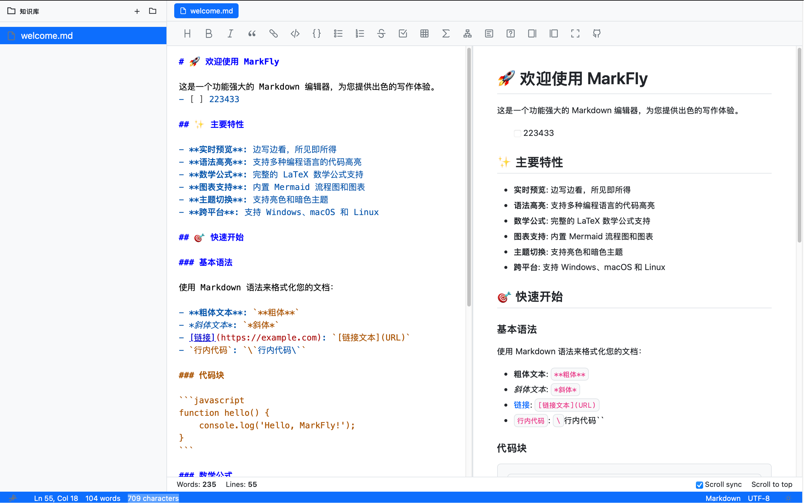

# MarkFly - 快到起飞的 Markdown 编辑器

**MarkFly** 是一款基于 Tauri + Vue + ByteMD 构建的现代化跨平台 Markdown 编辑器，专为追求极致性能和流畅体验的用户设计。

> ⚡ **快到起飞** - 启动速度 < 2秒，内存占用 < 100MB，让你专注于创作而非等待



## 📦 最新版本发布

### MarkFly v0.0.1 (2025-09-03)

我们很高兴地宣布 MarkFly 的第一个正式版本 v0.0.1 已经发布！这个版本包含了基础的 Markdown 编辑功能和跨平台支持。

#### 下载安装包

适用于不同操作系统的安装包已准备就绪：

- **Windows**: 
  - [MarkFly_0.0.1_x64-setup.exe](https://github.com/jwangkun/MarkFly/releases/download/v0.0.1/MarkFly_0.0.1_x64-setup.exe) (4.25 MB)
  - [MarkFly_0.0.1_x64_en-US.msi](https://github.com/jwangkun/MarkFly/releases/download/v0.0.1/MarkFly_0.0.1_x64_en-US.msi) (5.34 MB)
- **macOS**: 
  - [MarkFly_0.0.1_x64.dmg](https://github.com/jwangkun/MarkFly/releases/download/v0.0.1/MarkFly_0.0.1_x64.dmg) (5.65 MB)
  - [MarkFly_0.0.1_aarch64.dmg](https://github.com/jwangkun/MarkFly/releases/download/v0.0.1/MarkFly_0.0.1_aarch64.dmg) (5.57 MB)
- **Linux**: 
  - [MarkFly_0.0.1_amd64.AppImage](https://github.com/jwangkun/MarkFly/releases/download/v0.0.1/MarkFly_0.0.1_amd64.AppImage) (78.4 MB)
  - [MarkFly_0.0.1_amd64.deb](https://github.com/jwangkun/MarkFly/releases/download/v0.0.1/MarkFly_0.0.1_amd64.deb) (5.38 MB)
  - [MarkFly-0.0.1-1.x86_64.rpm](https://github.com/jwangkun/MarkFly/releases/download/v0.0.1/MarkFly-0.0.1-1.x86_64.rpm) (5.38 MB)

#### 版本特性

- 基础 Markdown 编辑功能
- 实时预览模式
- 代码语法高亮
- 数学公式支持
- Mermaid 图表渲染
- 图片缩放功能
- 文件管理（新建、打开、保存、另存为）
- 主题切换（亮色/暗色）
- 跨平台支持（Windows、macOS、Linux）

## 🎯 项目愿景

MarkFly 的目标是成为一款轻量级、高性能且功能丰富的 Markdown 编辑器，为技术写作、文档编写和日常笔记提供最佳体验。我们致力于：

- **性能优先**: 利用 Rust 和 Tauri 的优势，提供接近原生应用的性能
- **简洁设计**: 专注于核心功能，避免功能臃肿，保持界面简洁
- **跨平台兼容**: 在所有主流操作系统上提供一致的用户体验
- **开源协作**: 欢迎社区贡献，共同打造更好的 Markdown 编辑器

## 🗺️ 发展路线图

### 短期计划 (v0.1.x)
- [ ] 插件系统支持
- [ ] 自定义快捷键
- [ ] 更丰富的导出选项（PDF, HTML等）
- [ ] 云同步功能集成

### 中期计划 (v0.2.x)
- [ ] 协作编辑功能
- [ ] 版本历史管理
- [ ] 模板系统
- [ ] 更多主题选择

### 长期计划 (v1.0)
- [ ] 移动端应用
- [ ] AI 辅助写作功能
- [ ] 团队协作平台
- [ ] 完善的 API 支持

## ✨ 为什么选择 MarkFly？

与其他 Markdown 编辑器相比，MarkFly 具有以下独特优势：

### 🚀 极致性能
- 基于 Rust 构建，启动速度快，内存占用低
- Tauri 框架提供接近原生应用的性能体验
- 优化的渲染引擎，确保流畅的编辑体验

### 🖥️ 真正的跨平台
- 一套代码，多平台部署
- Windows、macOS、Linux 原生支持
- 一致的用户体验，无平台差异

### 🔧 现代化技术栈
- Vue 3 + TypeScript 前端架构
- ByteMD 编辑器核心，功能丰富
- Vite 构建工具，开发体验优秀

### 🎨 精心设计
- 简洁直观的界面
- 深色/浅色主题自动适配
- 响应式设计，适配不同屏幕尺寸

### 🌍 开源免费
- 完全开源，社区驱动
- 免费使用，无功能限制
- 欢迎贡献，共同完善

## ✨ 核心特性

- 🚀 **极致性能**: 基于 Rust + Tauri，启动快速，内存占用极低
- 🖥️ **跨平台支持**: 完美支持 Windows、macOS、Linux 三大操作系统
- 📝 **实时预览**: 分屏实时预览，所见即所得的写作体验
- 🎨 **语法高亮**: 支持 180+ 编程语言的代码高亮显示
- 📊 **图表支持**: 内置 Mermaid 流程图、时序图等图表渲染
- 🧮 **数学公式**: 完整的 LaTeX 数学公式支持
- 📋 **GFM 扩展**: 完整支持 GitHub Flavored Markdown 规范
- 🔍 **图片缩放**: 点击图片即可放大查看细节
- 💾 **文件管理**: 支持新建、打开、保存 Markdown 文件
- 🌙 **主题切换**: 支持亮色和暗色两种主题模式
- 🎯 **专注写作**: 简洁直观的界面设计，让你专注于内容创作

## 🔒 安全与隐私

MarkFly 非常重视用户的数据安全和隐私保护：

- **本地优先**: 所有文档默认保存在本地，不会上传到任何服务器
- **无网络权限**: 应用本身不需要网络连接即可正常工作
- **开源透明**: 所有代码公开可审查，确保无恶意行为
- **最小权限**: 仅在必要时请求文件系统访问权限
- **数据加密**: 支持对敏感文档进行加密存储（计划中）

## 🛠️ 技术栈

- **前端框架**: Vue 3 + TypeScript
- **编辑器核心**: ByteMD (基于 CodeMirror 6)
- **桌面框架**: Tauri (Rust)
- **构建工具**: Vite
- **插件系统**: 
  - `@bytemd/plugin-gfm` - GitHub Flavored Markdown
  - `@bytemd/plugin-highlight` - 代码语法高亮
  - `@bytemd/plugin-math` - 数学公式支持
  - `@bytemd/plugin-mermaid` - Mermaid 图表
  - `@bytemd/plugin-medium-zoom` - 图片缩放
  - `@bytemd/plugin-frontmatter` - Front Matter 支持

## 🚀 快速开始

### 环境要求

- Node.js 16+ 
- Rust 1.70+
- 系统要求：Windows 10+, macOS 10.15+, Linux (Ubuntu 18.04+)

### 安装依赖

```
# 安装前端依赖
npm install

# 安装 Tauri CLI (如果还没有安装)
npm install -g @tauri-apps/cli
```

### 开发模式

```
# 启动开发服务器
npm run tauri:dev
```

### 构建应用

```
# 构建生产版本
npm run tauri:build
```

## 📖 使用指南

### 快捷键

- `Ctrl/Cmd + N` - 新建文件
- `Ctrl/Cmd + O` - 打开文件
- `Ctrl/Cmd + S` - 保存文件
- `Ctrl/Cmd + Shift + P` - 切换预览模式

### 支持的文件格式

- `.md` - Markdown 文件
- `.markdown` - Markdown 文件
- `.txt` - 纯文本文件

## 🏗️ 项目结构

```
MarkFly/
├── src/                    # Vue 前端源码
│   ├── components/         # Vue 组件
│   ├── stores/             # 状态管理
│   ├── styles/             # 样式文件
│   ├── data/               # 示例数据
│   ├── App.vue             # 主应用组件
│   └── main.ts             # 应用入口
├── src-tauri/              # Tauri 后端源码
│   ├── src/                # Rust 源码
│   ├── icons/              # 应用图标
│   ├── Cargo.toml          # Rust 依赖配置
│   └── tauri.conf.json     # Tauri 配置
├── package.json            # Node.js 依赖配置
├── vite.config.ts          # Vite 构建配置
└── README.md               # 项目说明
```

## 🤝 贡献指南

欢迎贡献代码！请遵循以下步骤：

1. Fork 本仓库
2. 创建特性分支 (`git checkout -b feature/AmazingFeature`)
3. 提交更改 (`git commit -m 'Add some AmazingFeature'`)
4. 推送到分支 (`git push origin feature/AmazingFeature`)
5. 开启 Pull Request

## 📄 许可证

本项目采用 MIT 许可证 - 查看 [LICENSE](LICENSE) 文件了解详情。

## 🙏 致谢

- [Tauri](https://tauri.app/) - 跨平台桌面应用框架
- [Vue.js](https://vuejs.org/) - 渐进式 JavaScript 框架
- [ByteMD](https://bytemd.js.org/) - 可扩展的 Markdown 编辑器
- [Vite](https://vitejs.dev/) - 下一代前端构建工具

## 📞 联系我们

- 项目主页: [GitHub](https://github.com/jwangkun/MarkFly.git)
- 问题反馈: [Issues](https://github.com/jwangkun/MarkFly.git/issues)
- 功能建议: [Discussions](https://github.com/jwangkun/MarkFly.git/discussions)

---

⭐ 如果这个项目对你有帮助，请给我们一个 Star！